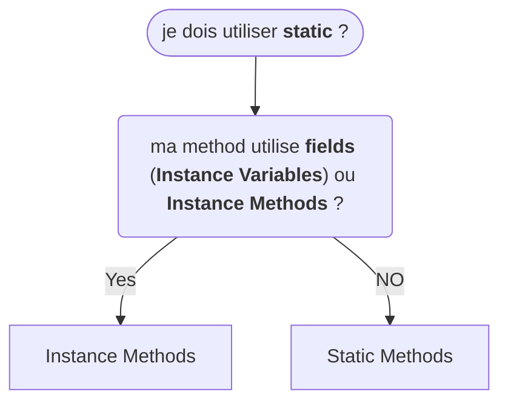

# Class & Oriented Object Programming - Part 1

<u>Class Access Keyword</u>

- __public__ : n'importe quelle autre class peut y acceder dans n'importe quel autre package.
- __protected__ : seulement dans le même package, ou sous class dans d'autres package.
- _**sans modifier**_ : appelé _package access_ les membres sont accessible seulement aux classes du meme package
- __private__ : _(encapsulation)_ seulement dans la class declarée.

<u>Static Variables</u>

- __static__ commu sous le nom "member variables"

toutes les instances d'une class partage les mêmes __static variables__

 ```java
class Dog {
  private static String name;

  public Dog(string name) {
    Dog.name = name;
  }

  public void printName() {
    System.out.println("name = " + name); // using Dog.name would have made this code less confusing
  }
}

public class Main {
  public static void main(String[] args) {
    Dog rex = new Dog("rex"); // create instance ("rex")
    Dog fluffy = new Dog("fluffy"); // create instance ("fluffy")

  rex.printName(); // prints fluffy
  fluffy.printName(); // prints fluffy 
  }
}
 ```

<u>Instance Variables</u>

- chaque instance a sa propre copie de la varible d'instance,
- chaque instance peu avoir un valeur differente,
- __Instance Variables__ représentent _le state_, l'état, d'une instance spécifique

 ```java
class Dog {
  private String name; // remove static

  public Dog(string name) {
    this.name = name; // replace Dog this this
  }

  public void printName() {
    System.out.println("name = " + name);
  }
}

public class Main {
  public static void main(String[] args) {
    Dog rex = new Dog("rex"); // create instance ("rex")
    Dog fluffy = new Dog("fluffy"); // create instance ("fluffy")

  rex.printName(); // prints rex
  fluffy.printName(); // prints fluffy 
  }
}
 ```

---

## References Vs. Object Vs. Instances Vs. Class

 un classe creer en objet en instanciant une classe

Object et instastances sont des termes interchangeables.

on peu creer plusieurs objects, avec un classe. tous peuvent avoir des attributs ou des valeurs unique.

> une __classe__ peut être le __plan__ de la maison.
avec un __plan__ on peut faire plusieurs maison
chaque maison créée est un (__new__) __object__
cet __object__ peut être nommé __instance__ (on dit __instance__ d'une __classe__), on aurait un __instance__ de maison.
chaque maison créée a une adresse physique (__reference__)
on peut copier cette __reference__ autant qu'on veut, mais on se referer toujours a la même maison : on copie l'adresse pas la maison.

---

 ```java
 House blueHouse = new House("blue");
 ```

ce code creer une nouvelle instance de la classe __House__, __House__ est le _plan_ on lui assigne la varible __blueHouse__.
 c'est la <u>référence</u> de l'object en mémoire

 ```java
 House anotherHouse = blueHouse;
 ```

 ce code creer un autre __référence__ du meme object en memoire, on obtient donc 2 __référence__ qui pointent vers le même object: il y a une maison, 2 __référence__

```java
System.out.println(blueHouse.getColor()); // blue
System.out.println(anotherHouse.getColor()); // blue
```

 >on a 2 papier avec la même adresse

```java
anotherHouse.setColor("Yellow");

System.out.println(blueHouse.getColor()); // Yellow
System.out.println(anotherHouse.getColor()); // Yellow
```

__blueHouse__ & __anotherHouse__ prints yellow parce qu'on a <u>2 __references__ qui pointent vers le même __object__ en memoire</u>, si on change la couleur de l'un , l'autre sera aussi modifié
> on a toujours 'une seule maison, meme si l'adresse est notée sur 2 papier differents

```java
House greenHouse = new House("green");
```

on creer une nouvelle __instance__, un nouvel __object__ de la classe __House__ on aura 2 objects en memoire, mais 3 __références__ : `blueHouse`, `anotherHouse`, `greenHouse`.

la variable (__référence__): `greenHouse` pointe vers un different __object__ en mémoire, mais `blueHouse` &`anotherHouse` pointent vers le même object en mêmoire.

```java
anotherHouse = greenHouse;
```

on assigne `anotherHouse` à `greenHouse`. on _déréference_ `anotherHouse`, il pointe vers un nouvel __object__ en mémoire,
on a toujours 2 __objects__ en memoire, et 3 __références__

```java
System.out.println(blueHouse.getColor()); // Yellow
System.out.println(greenHouse.getColor()); // green
System.out.println(anotherHouse.getColor()); // green
```

---

## Static Methods Vs. Instance Methods

### Static Methods

- déclarée en utilisant `static`
- ne peut acceder aux __Instance Methods__ & __Instance Variables__
- utilisée pour les operations qui ne necessite pas de donnée de puis l'instance de la class <u>_`this.`_</u>
  - `this`: current instance
- on ne peu pas utiliser `this`

```java
class Calculator {
  public static void printSum(int a, int b) {
    System.out.println("sum = " + (a + b));
  }
}

public class Main {
  public static void main(String[] args) {
    Calculator.printSum(5 ,10);
    printHello(); // shorter from of Main.printHello();
  }

  public static void printHello() 
    System.out.println("Hello World!");
  }
}
```

__Static Methods__ sont appelée : `ClassName.methodName();` ou `methodName();` => seulement si dans la même class.

- ```java
    Calculator.printSum(5 ,10);
    printHello();
  ```

---

### Instance Methods

- appartiennent a un instance, a une class
- pour l'utiliser, il faut l'instancier an utilisant __`new`__
- peut acceder aux __Instance Methods__, __Instance Variables__ & __Static Methods__, __Static Variables__

```java
class Dog {
  public void bark() { // no « static »
    System.out.println("Woof"));
  }
}

public class Main {
  public static void main(String[] args) {
    Dog rex = new Dog(); // create instance
    rex.bark(); // call instace method
  }
}
```


